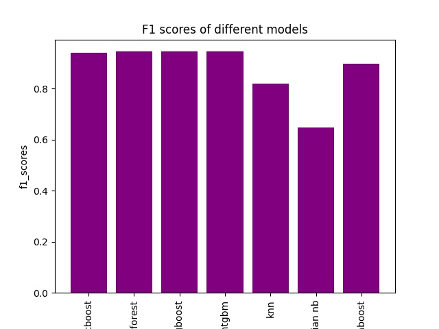

# iFood Marketing ML Classification

This project explores the iFood marketing dataset and builds several machine‑learning models to predict customer behavior. The goal is to compare multiple classification algorithms and evaluate how well they can model marketing response patterns.

The project includes:

- Data cleaning and preprocessing
- Exploratory Data Analysis (EDA)
- Training several ML models
- Comparing model performance using F1 score

## Dataset

The dataset contains demographic information, product spending habits, purchase channels, and marketing campaign responses from iFood customers.

Key feature groups include:

- Income, Kidhome, Teenhome
- Recency
- Product spending (MntWines, MntFruits, MntMeatProducts, MntFishProducts, MntSweetProducts, MntGoldProds)
- Purchase behavior (NumWebPurchases, NumCatalogPurchases, NumStorePurchases, NumDealsPurchases, NumWebVisitsMonth)
- Campaign acceptance (AcceptedCmp1–5, AcceptedCmpOverall)

The dataset used in this project is stored locally under:
data/ifood_df.csv

## Model Performance Comparison

Below is the F1 score comparison of all trained machine‑learning models:

## Models Used

The following machine‑learning models were trained and evaluated:

- CatBoost
- Random Forest
- XGBoost
- LightGBM
- K‑Nearest Neighbors
- Gaussian Naive Bayes
- AdaBoost

Evaluation metric: **F1 Score**

## Technologies Used

- Python
- pandas
- NumPy
- scikit‑learn
- XGBoost
- LightGBM
- CatBoost
- Matplotlib / Seaborn
- Jupyter Notebook

## Notes

This project is intended for learning and experimentation with supervised machine‑learning models using a real‑world consumer marketing dataset.
